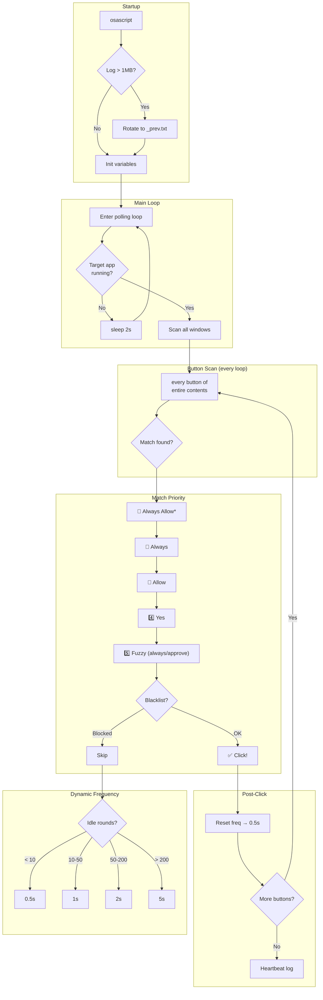

# 🤖 AlwaysAllow Bot

**Stop clicking "Allow" a thousand times a day.**

A lightweight macOS AppleScript daemon that automatically clicks "Always Allow", "Allow", "Yes" and similar permission confirmation buttons in Electron-based apps — so your AI coding agents (Cursor, Claude Code, Kiro, etc.) can run uninterrupted.

---

## 😤 The Problem

Modern AI coding assistants require constant human approval:

> "Allow Bash(python3 script.py)?"  
> "Always Allow all Write?"  
> "Allow file access to /Users/..."  

You end up babysitting your AI agent, clicking "Always Allow" every 30 seconds. **AlwaysAllow Bot fixes this.**

---

## ✨ Features

| Feature | Description |
|---------|-------------|
| 🎯 **Smart Matching** | Priority-based: `Always Allow*` > `Always` > `Allow` > `Yes` > fuzzy match |
| 🚫 **Blacklist** | Never clicks: Reject, No, Deny, Cancel, Block |
| ⚡ **Dynamic Polling** | 0.5s when active → auto-slows to 5s when idle (saves CPU) |
| 📊 **Smart Logging** | Dynamic heartbeat + auto-rotation at 1MB |
| 🪟 **Multi-Window** | Monitors all windows of target app |
| 🔍 **Sidebar Detection** | Finds "Awaiting approval" sessions and switches to them |
| 🔁 **Drain Mode** | Batch-clears queued permission dialogs |
| 🚀 **LaunchAgent** | Boot-persistent, auto-restarts on crash |
| 🌐 **i18n Ready** | Supports English + Chinese button labels |

---

## 🚀 Quick Start (30 seconds)

### Prerequisites

Grant Accessibility permission:

**System Settings → Privacy & Security → Accessibility** → Add:
- `/Applications/Utilities/Terminal.app` (or iTerm2)
- `/usr/bin/osascript`

### Configure

Edit `always-allow-bot.applescript` line 35:

```applescript
set TARGET_APP_NAME to "Cursor"  -- Change to your app's process name
```

Find your app's process name:
```bash
ps aux | grep -i "cursor\|code\|claude\|quick" | grep -v grep
```

### Run

```bash
# Background (recommended)
nohup osascript always-allow-bot.applescript > /tmp/always_allow_log.txt 2>&1 &

# Watch it work
tail -f /tmp/always_allow_log.txt
```

---

## 📦 Install as Launch Daemon (auto-start on boot)

```bash
# Copy to system path
sudo cp always-allow-bot.applescript /usr/local/bin/
cp com.alwaysallow.bot.plist ~/Library/LaunchAgents/

# Load
launchctl load ~/Library/LaunchAgents/com.alwaysallow.bot.plist

# Verify
launchctl list | grep alwaysallow
```

### Uninstall

```bash
launchctl unload ~/Library/LaunchAgents/com.alwaysallow.bot.plist
rm ~/Library/LaunchAgents/com.alwaysallow.bot.plist
sudo rm /usr/local/bin/always-allow-bot.applescript
```

---

## 📋 Commands

| Action | Command |
|--------|---------|
| Start | `nohup osascript always-allow-bot.applescript > /tmp/always_allow_log.txt 2>&1 &` |
| Stop | `pkill -f always-allow-bot` |
| Status | `ps aux \| grep always-allow \| grep -v grep` |
| Logs | `tail -f /tmp/always_allow_log.txt` |
| Stats | `grep "点击" /tmp/always_allow_log.txt \| tail -10` |

---

## 🏗️ Architecture



---

## 🎯 Button Matching Rules

### Priority (highest to lowest)

1. **`Always Allow *`** — prefix match (e.g., "Always Allow Bash(...)")
2. **`Always`** — exact match
3. **`始终允许`** — Chinese exact match
4. **`Allow`** — exact match (fallback)
5. **`Yes`** — exact match (final fallback)
6. **Fuzzy** — contains "always" or "approve" (case-insensitive)

### Blacklist (never clicked)

`Reject` · `No` · `Deny` · `Cancel` · `Block` · `拒绝` · `取消`

---

## 📊 Performance

Tested over 5 days continuous operation:

| Metric | Value |
|--------|-------|
| Uptime | 61+ hours |
| Clicks handled | 30 |
| Errors | 0 |
| Idle CPU | ~1% |
| Active CPU | ~5% |
| Memory | Minimal |

---

## 🔧 Troubleshooting

| Issue | Fix |
|-------|-----|
| Not clicking | Check Accessibility permission; verify process name |
| High CPU | Normal during active clicking (~5%); idle should be ~1% |
| Log too large | Auto-rotates at 1MB; manual: `> /tmp/always_allow_log.txt` |
| New button type | Fuzzy matching catches "always"/"approve" variants |
| App updated | Check if process name changed via `ps aux` |

---

## 🤝 Compatible Apps

Works with any Electron-based app that exposes buttons via macOS Accessibility API:

- **Cursor** IDE
- **Claude** Desktop
- **VS Code** (with extensions that prompt)
- **Kiro** coding agent
- Any MCP-compatible AI tool with permission dialogs

---

## 📄 License

MIT — do whatever you want with it. Just stop clicking "Allow" manually. 🎉

---

## 🙏 Why This Exists

Because clicking "Always Allow" 30 times a day while your AI agent writes code is not "human-in-the-loop" — it's "human-as-a-rubber-stamp". If you've decided to trust the agent, let the bot handle the paperwork.
